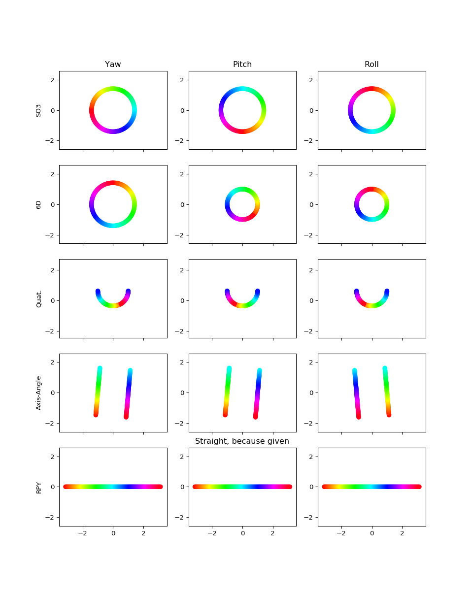

# 6d

This function re-implements the 6D projection functions of https://arxiv.org/pdf/1812.07035.pdf for quaternions.

The following artefacts for the PCA projections remain:
- 6D projection for Yaw is scaled by 2
- Axis-Angle projection is a bit off
- RPY is **no artefact**, since I just projected the ground truth values via PCA
